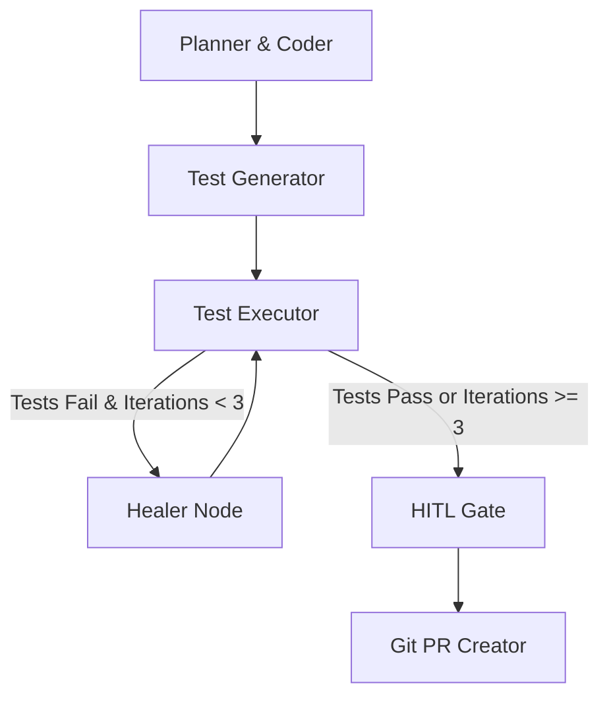

<div align="center">
  
  
  
  

  <br />
  
  <h1>🤖 Autonomous Self-Healing PR Agent</h1>
  <p>An AI agent that autonomously writes code, writes tests, runs tests, and fixes its own mistakes before opening a GitHub Pull Request.</p>
</div>

---

## 📖 Overview

The **Autonomous Self-Healing PR Agent** is an advanced AI agent powered by **LangGraph** and **Google Gemini 1.5**. 
It is designed to handle complex coding tasks by simulating the workflow of an autonomous developer:

1. **Code Generation:** Reads the task and generates the required source code.
2. **Test Generation:** Drafts comprehensive `pytest` unit tests for the newly written code.
3. **Execution Sandbox:** Runs the tests in a sandboxed subprocess.
4. **Self-Healing Loop:** If the tests fail, the agent feeds the traceback back to the LLM to rewrite the faulty code. It repeats this until the tests pass!
5. **Git Integration:** Automatically creates a new branch, commits the verified code, and pushes the Pull Request.

It can be run via CLI for headless automation (e.g., GitHub Actions) or monitored live via a Read-Only Streamlit Dashboard.

---

## ✨ Features

- **LangGraph Architecture:** Stateful graph nodes handling distinct responsibilities (Planning, QA, Execution, Healing).
- **Infinite Loop Prevention:** Built-in iteration caps (max 3 loops) before escalating to a Human-in-the-Loop (HITL) gate.
- **Live Streamlit Observability:** A beautiful, zero-input dashboard to watch the agent think, execute, and heal in real-time.
- **CI/CD Ready:** Includes a `.github/workflows/agent_run.yml` to trigger the agent automatically on repository events.

---

## 🛠️ Tech Stack

- **Orchestration:** LangGraph (StateGraph with cycles)
- **LLM:** Google Gemini 1.5 Pro / Flash via `langchain-google-genai`
- **Testing Engine:** Python `subprocess` with `pytest`
- **Git Operations:** `GitPython`
- **UI:** `Streamlit`

---

## 🚀 Getting Started

### 1. Installation

Clone the repository and install the dependencies:

```bash
git clone https://github.com/Arijdev/Self-Healing-PR-Agent.git
cd Self-Healing-PR-Agent
python -m venv venv
source venv/bin/activate  # On Windows use `venv\Scripts\activate`
pip install -r requirements.txt
```

### 2. Configuration

Copy the example environment variables file and fill in your keys:

```bash
cp .env.example .env
```

Ensure you configure:
- `GEMINI_API_KEY`: Your Google Gemini API Key.
- `GITHUB_TOKEN`: A Personal Access Token (PAT) with repo scopes.
- `TARGET_REPO_URL`: (Optional) The URL of the repository for dashboard display.

### 3. Usage

**Headless CLI Mode (Ideal for CI/CD):**
Run the agent in terminal. It will set up a mock file, run the self-healing workflow, and print transitions.
```bash
python main.py
```

**Live Observability Dashboard:**
Launch the Streamlit app to monitor the LangGraph execution states visually.
```bash
streamlit run app.py
```

### 4. Streamlit Cloud Deployment

If you are deploying this dashboard to **Streamlit Community Cloud**, your `.env` file will not be pushed to GitHub (for security). Instead, you must configure your secrets in the Streamlit Cloud Dashboard:

1. Go to your app's dashboard on Streamlit Cloud.
2. Click **Manage App** -> **Settings** -> **Secrets**.
3. Add your keys in TOML format:
```toml
GEMINI_API_KEY="your_api_key_here"
GITHUB_TOKEN="your_github_token_here"
```

---

## 🧠 Architecture Flow



---

<div align="center">
  <i>Built with LangGraph and Streamlit.</i>
</div>
